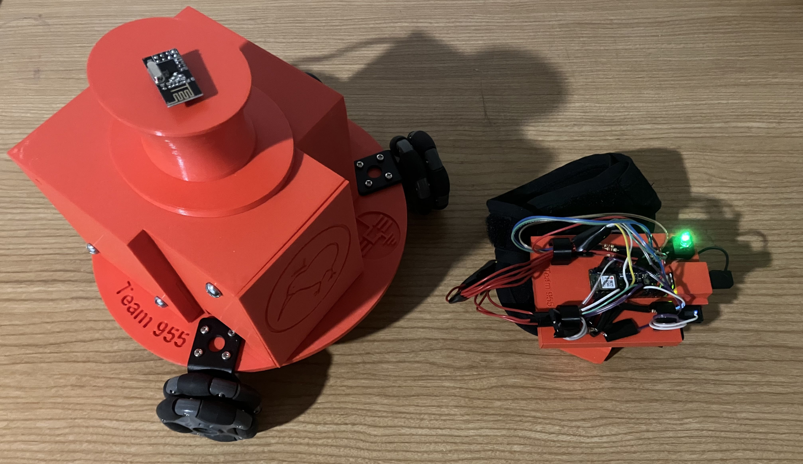
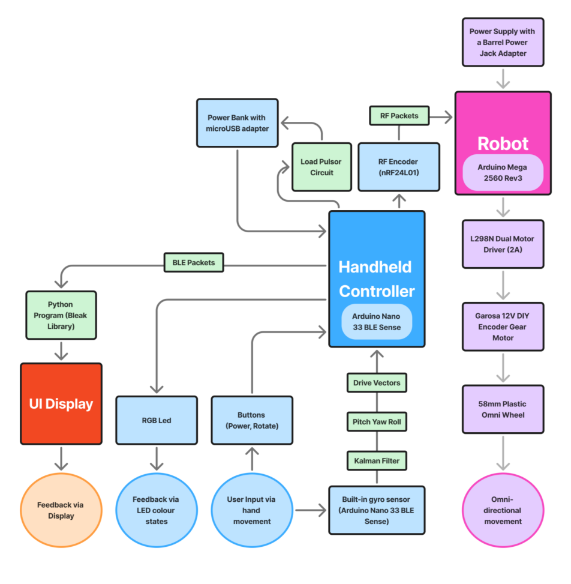

# KiwiBot

 
  

<!-- TOC -->
* [KiwiBot](#kiwibot)
  * [Inspiration, Purpose and Goals](#inspiration-purpose-and-goals)
  * [What It Does / Overview](#what-it-does--overview)
  * [File Organization / How It's Made](#file-organization--how-its-made)
  * [Challenges Faced](#challenges-faced)
  * [Accomplishments To Be Proud Of](#accomplishments-to-be-proud-of)
  * [Next Steps](#next-steps)

## Inspiration, Purpose and Goals
The public Ontario High School Curriculum only offers 6 courses regarding Computer Engineering and 0 courses regarding Electrical Engineering. Additionally schools are NOT required to facilitate this very limited selection of courses (only 9 out of the 26 schools in the Dufferin Peel Cathloic District offer a Computer Technology course). On interviewing high school teachers, many were frustrated that students say they want to be in STEM but don't know anything about it.

This project's motivation is to bridge the gap between classroom concepts and a physical, engaging and interactive module with the goal of sparking an interest in high schoolers to pursue engineering at the high school level.

The primary design goals of this project were to do what other hobby robots didn't, to invoke a sense of technically prowress. Research identified omni-directional movement, a single-handed control system, and real-time feedback to be areas of focus.

## What It Does / Overview
KiwiBot is a small-sized (10x10x16'') robot, capable of omni-directional movement on a planar surface using a KiwiDrive drive system, controlled by a gyroscopic sensor on a one-size-fits-all wearable glove and makes use of LED states and an accompanying computer program to provide optional feedback to the user.

### Design Breakdown

Here you can see an overview of the design with inputs/outputs designated as circles at the bottom, primarily virtual processes in green, robot encapsulated structures in pink, handheld/glove controller encapsulated structures in blue, and the accompanied UI display structure in orange.

- Refer to Media/Pictures and Videos to see KiwiBot in action

## File Organization / How It's Made

Refer to User Guide for setup and usage information

Refer to Construction Guide for system design information

Refer to arduino_sketches for the logic of the robot, the glove controller and tuning which are written in `C++`

Refer to scripts for supportive visuals that can be run on a computer which are written in `Python`

Refer to CAD_Files for CAD design and 3D printing files

## Challenges Faced
The greatest challenge of this project was getting accurate tilt controls that felt good and intuitive. Of the ~25 people that used the design, it’s clear that for some it comes very easily,
while for others it’s hard to understand. During the early phases of construction, one of the major choices being made was to use either an MPU6050 or an MCU with built-in IMUs
like the Arduino Nano 33 BLE Sense Rev2 (BMI270 + BMM150). Due to a desire to simplify the hardware on the Controller as much as possible along with budget constraints, the Arduino Board with built-in sensors would be selected. It should be noted that both IMUs are able to achieve a IMU measurement range of +/- 4 Gs on the accelerometer and +/- 2000 deg/s on the
gyroscope, but the Arduino also has the BMM150 to make it a 9-axis sensor. Another consideration going into choosing the Arduino is that with an internal measurement unit built-in, sampling rate is automatically handled and overhead to prompt the sensors is minimized, whereas with an external measurement unit, communication would have to be over a serial bus and potentially susceptible to noise from other hardware on the controller. 

It should also be noted after much testing, that the magnetometer (BMM150) is highly unreliable and susceptible to noise in the environment, hence its influence in the Kalman Filter design was heavily reduced to be a simple error tracking term for the gyroscopic sensor’s yaw predictions. Over the course of the project several different filters would be tested to get better results. The process can be seen in the gyro_tuning.ino file, which contains the functions used to tune the gyroscopic and magnetometer sensors, as well as manually analyzing the predictions of independent sensors alone, complementary filters, and Madgwick filters. To see these, simply connect the Arduino Nano to a computer, uncomment a desired function in the main loop of the program in Arduino IDE and upload the sketch. The Kalman filter would however be selected and implementing in the gyro_main_ble.ino file because it was highly tunable to the design, leading to the best results given the condition that the Controller is not turned upside down as a result of using Euler angles over quaternions. It is a result of all these considerations and a LOT of testing and tuning for error margins that this challenge was conquered.

## Accomplishments To Be Proud Of
This project has two major accomplistments I would personally like to highlight:

I would firstly like to shoutout two private high schools, Sherwood Heights School and Kings Christian Collegiate, for allowing me to present the design in a live environment to high school students who wanted to learn more about engineering. Seeing a project through to a point were a target audience can use the design and I can collect feedback for further adjustments and improvements is always a pleasure and making an impact on worth celebrating. I should also note that on follow-up conversations with my contacts at these schools, I would learn that students would continue to discuss the event for a few days after it occured.

Secondly I'd like to shoutout my supervising professor, Belinda Wang, who nominated the project for a distinction in recognizing the effort that was put in and the results it would achieve. Additionally, the professor, among the other schools who were also interested in acquiring the project, was so impressed she would acquire KiwiBot for $591.99 to use in future demonstrations in highlighting the engineering design process.

## Next Steps
1. Single-handed tilt controls are unique and technically impressive to students, as well as
covers up the floaty control and motor drift during runtime. That said, there are ultimately
better methods of control. It was determined about halfway through the project that a
controller with 2 analog potentiometer joysticks (one to control orientation and one to
control direction of movement; or simply just one for the latter) rather than a glove would
be easier and snappier to control, assuming PID control is implemented to remove motor
drift. It is entirely possible to implement a controller that does both joystick and tilt
control and can swap between those methods of control, even while maintaining the
wearable glove concept.
2. One of the major recommendations for taking this project further is reducing costs to turn
it into a workshop kit. A drastic way to do this would be to cut out the Robot entirely.
With the hardware of the Controller alone, the project would consist of the Arduino Nano
33 BLE Sense Rev2, two push buttons, an RGB Led, and the power bank. However, even
such a large power bank used in the project is not needed and can be swapped out for AA
batteries instead, given the low power nature of the Controller. This would reduce costs
approximately to $80 per kit.
3. In tandem with Recommendation 2, without a physical Robot the simulation software
should be heavily advanced. It is possible to let students CAD out their own KiwiDrive
Robot or use a base template Robot, for which they can port into a 3D software
simulation and control the Robot through a digital landscape with the Controller. Once
they have done a software simulation test, they could try their controller out on the real
thing, with one shared physical Robot, that we’ve already made. This would be a major
undertaking potentially worth another Capstone Project.
4. Another method of reducing costs would be to not use Arduino boards that come with a
lot of extra bloat hardware but rather have a person who can design custom PCBs with
select chips, which was originally intended at the start of this project. Currently ~25% of
the project costs are from the Arduino boards. This would also help reduce space these
components require.
5. The wiring of the Controller is exposed and very vulnerable to weather conditions.
Although it wasn’t in the scope of this project, it was initially desired and is
recommended that the hardware for the Controller be contained within a protective
casing.
6. Occasionally PWM/DIR wires connecting to the Arduino Mega 2560 (on the second
layer) come loose from the L298Ns (on the base layer). Find a fix for this; currently using
electrical tape as a stand-in.
7. Fix sticky button on Controller.

